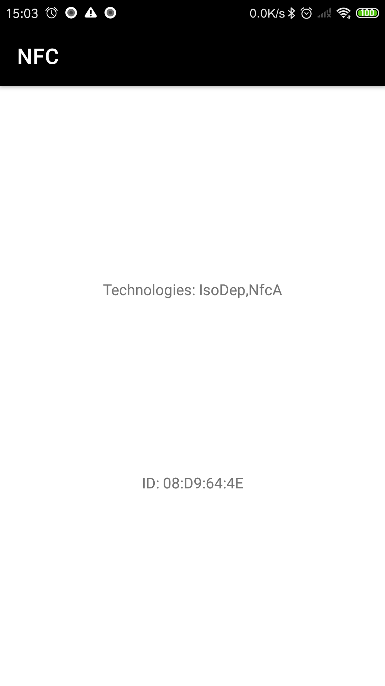

# NFC

Near Field Communication (NFC) is a set of short-range wireless technologies, typically requiring a distance of 4cm or less to initiate a connection.

## Screenshot

## Feature

- NFC Card Reader
  - Read and Display ID and supported TECHS of an NFC Card(Transportation Card, ID Card, etc).
- Host-based Card Emulation(HCE)
  - Coming SOON...

## Tech Stack

- NfcAdapter
- Tag
- PendingIntent

## Tool

- Android Studio Dolphin | 2021.3.1 Patch 1

## Attribution

**AS OF 2022/12**

- [ic_launcher](https://www.flaticon.com/free-icon/nfc_5895155) created by wen_ardhie - Flaticon

## Reference

- [Near field communication overview](https://developer.android.com/guide/topics/connectivity/nfc)
- [Host-based card emulation overview](https://developer.android.com/guide/topics/connectivity/nfc/hce)

## License

Copyright 2022 RandX(<010and1001@gmail.com>)

Licensed under the Apache License, Version 2.0 (the "License");
you may not use this file except in compliance with the License.
You may obtain a copy of the License at

    http://www.apache.org/licenses/LICENSE-2.0

Unless required by applicable law or agreed to in writing, software
distributed under the License is distributed on an "AS IS" BASIS,
WITHOUT WARRANTIES OR CONDITIONS OF ANY KIND, either express or implied.
See the License for the specific language governing permissions and
limitations under the License.