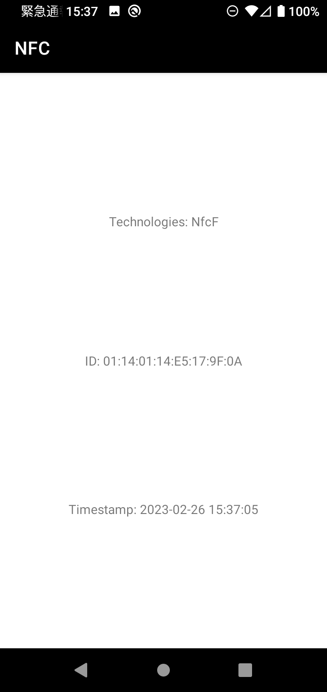
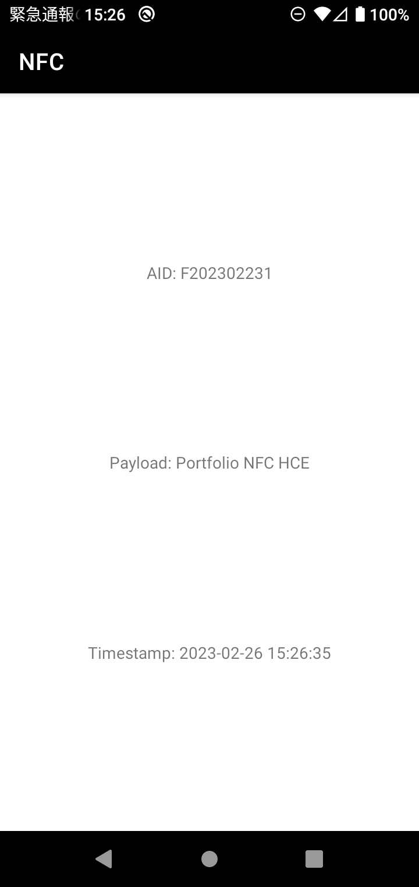

# NFC

Near Field Communication (NFC) is a set of short-range wireless technologies, typically requiring a distance of 4cm or less to initiate a connection.

## Screenshot

| Card Reader(Physical) | Card Reader(HCE) |
| ----------- | ----------- |
|  |  |

## Feature

- Check Availability(Supported, ON/OFF)
- NFC Card Reader
  - Read and Display ID and supported TECHS of an NFC Card(Transportation Card, ID Card, etc).
- Host-based Card Emulation(HCE)
  - Emulate an NFC card
  - Read and Display AID and Payload

## Tech Stack

- [NfcAdapter](https://developer.android.com/reference/android/nfc/NfcAdapter)
- [Tag](https://developer.android.com/reference/android/nfc/Tag)
- [PendingIntent](https://developer.android.com/reference/android/app/PendingIntent)
- [HostApduService](https://developer.android.com/reference/android/nfc/cardemulation/HostApduService)
- [ReaderCallback](https://developer.android.com/reference/android/nfc/NfcAdapter.ReaderCallback)

## Attribution
**AS OF 2022/12**

- [ic_launcher](https://www.flaticon.com/free-icon/nfc_5895155) created by wen_ardhie - Flaticon

## Reference

- [Near field communication overview](https://developer.android.com/guide/topics/connectivity/nfc)
- [Host-based card emulation overview](https://developer.android.com/guide/topics/connectivity/nfc/hce)
- [Android CardReader Sample](https://github.com/googlearchive/android-CardReader)
- [Android CardEmulation Sample](https://github.com/googlearchive/android-CardEmulation)
- [Android HCE: are there rules for AID?](https://stackoverflow.com/questions/27533193/android-hce-are-there-rules-for-aid)

## License

Copyright 2022-2023 RandX(<010and1001@gmail.com>)

Licensed under the Apache License, Version 2.0 (the "License");
you may not use this file except in compliance with the License.
You may obtain a copy of the License at

    http://www.apache.org/licenses/LICENSE-2.0

Unless required by applicable law or agreed to in writing, software
distributed under the License is distributed on an "AS IS" BASIS,
WITHOUT WARRANTIES OR CONDITIONS OF ANY KIND, either express or implied.
See the License for the specific language governing permissions and
limitations under the License.