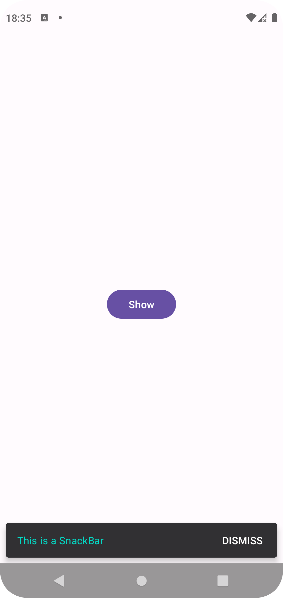
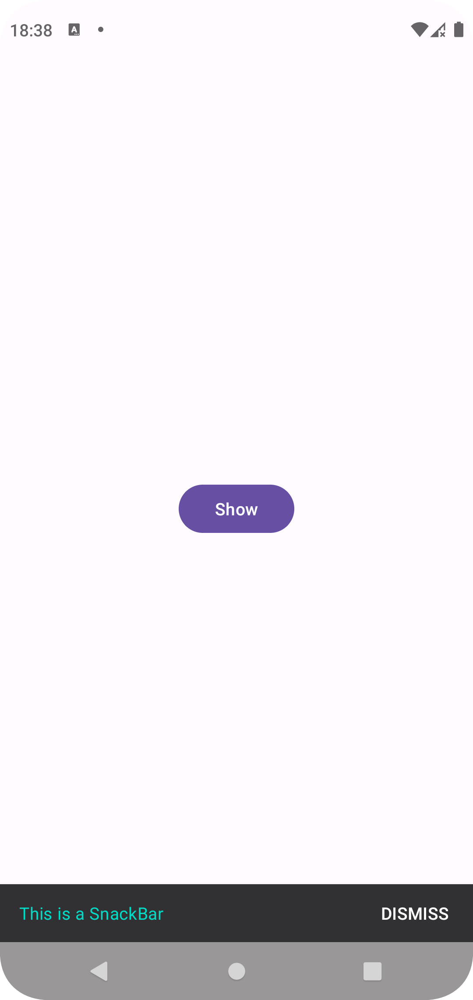

# Snackbar

Snackbars provide lightweight feedback about an operation. They show a brief message at the bottom of the screen on mobile and lower left on larger devices. Snackbars appear above all other elements on screen and only one can be displayed at a time.

## Screenshot

| New Style | Old Style |
| --- | --- |
|  |  |

## Tech Stack

- [Snackbar](https://developer.android.com/reference/com/google/android/material/snackbar/Snackbar)
- [Snackbar(Source Code)](https://github.com/material-components/material-components-android/blob/master/lib/java/com/google/android/material/snackbar/Snackbar.java)

## Tips

By default the new style SnackBar will be used.  
For OLD style SnackBar add the following code to your themes file.

```xml
<item name="snackbarStyle">@style/Widget.Material3.Snackbar.FullWidth</item>
```

## License

Copyright 2023 RandX(<010and1001@gmail.com>)

Licensed under the Apache License, Version 2.0 (the "License");
you may not use this file except in compliance with the License.
You may obtain a copy of the License at

    http://www.apache.org/licenses/LICENSE-2.0

Unless required by applicable law or agreed to in writing, software
distributed under the License is distributed on an "AS IS" BASIS,
WITHOUT WARRANTIES OR CONDITIONS OF ANY KIND, either express or implied.
See the License for the specific language governing permissions and
limitations under the License.
