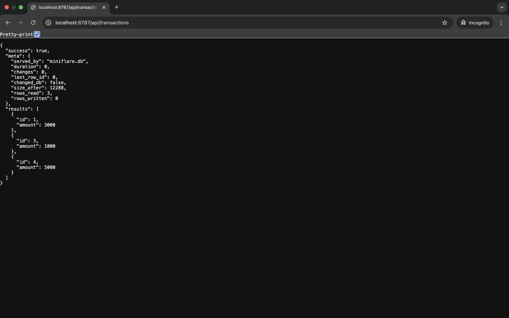

# D1

[D1](https://developers.cloudflare.com/d1/) is Cloudflare's managed, serverless database with SQLite's SQL semantics, built-in disaster recovery, and Worker and HTTP API access.

## Screenshot



## Run in local

```Shell
npx wrangler dev
```

## Test the API

/api/transactions

```Shell
curl "http://localhost:8787/api/transactions"
```

/api/transactions/:id

```Shell
curl "http://localhost:8787/api/transactions/1"
```

/api/transactions/create

```Shell
curl -X POST -d '{"amount": 1000}' http://localhost:8787/api/transactions/create
```

/api/transactions/delete/:id

```Shell
curl -X DELETE http://localhost:8787/api/transactions/delete/2 
```

## Deploy to remote

```Shell
npx wrangler d1 execute workers-d1 --file=./schemas/schema.sql --remote

npx wrangler deploy
```

## Reference

- [Build an API to access D1 using a proxy Worker](https://developers.cloudflare.com/d1/tutorials/build-an-api-to-access-d1/)

## License

Copyright 2025 RandX(<010and1001@gmail.com>)

Licensed under the Apache License, Version 2.0 (the "License");
you may not use this file except in compliance with the License.
You may obtain a copy of the License at

    http://www.apache.org/licenses/LICENSE-2.0

Unless required by applicable law or agreed to in writing, software
distributed under the License is distributed on an "AS IS" BASIS,
WITHOUT WARRANTIES OR CONDITIONS OF ANY KIND, either express or implied.
See the License for the specific language governing permissions and
limitations under the License.
