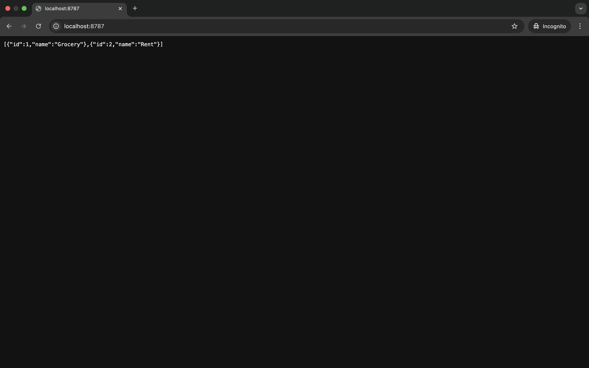

# Prisma ORM

[Prisma ORM](https://github.com/prisma/prisma) is a Next-generation ORM for Node.js & TypeScript | PostgreSQL, MySQL, MariaDB, SQL Server, SQLite, MongoDB and CockroachDB

## Screenshot



## Initialize Prisma ORM

```Shell
npm install prisma --save-dev

npm install @prisma/client
npm install @prisma/adapter-d1

npx prisma init --datasource-provider sqlite
```

## Create a table

```Shell
npx wrangler d1 migrations create workers-prisma create_category_table

npx prisma migrate diff --from-empty --to-schema-datamodel ./prisma/schema.prisma --script --output migrations/0001_create_category_table.sql

# For the local database
npx wrangler d1 migrations apply prisma-demo-db --local
# For the remote database
npx wrangler d1 migrations apply prisma-demo-db --remote
```

## Run in local

```Shell
npx wrangler dev
```

## Deploy to remote

```Shell
npx wrangler deploy
```

## Reference

- [Query D1 using Prisma ORM](https://developers.cloudflare.com/d1/tutorials/d1-and-prisma-orm/)

## License

Copyright 2025 RandX(<010and1001@gmail.com>)

Licensed under the Apache License, Version 2.0 (the "License");
you may not use this file except in compliance with the License.
You may obtain a copy of the License at

    http://www.apache.org/licenses/LICENSE-2.0

Unless required by applicable law or agreed to in writing, software
distributed under the License is distributed on an "AS IS" BASIS,
WITHOUT WARRANTIES OR CONDITIONS OF ANY KIND, either express or implied.
See the License for the specific language governing permissions and
limitations under the License.
