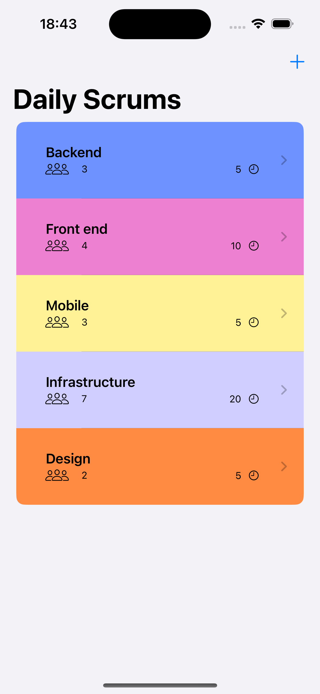
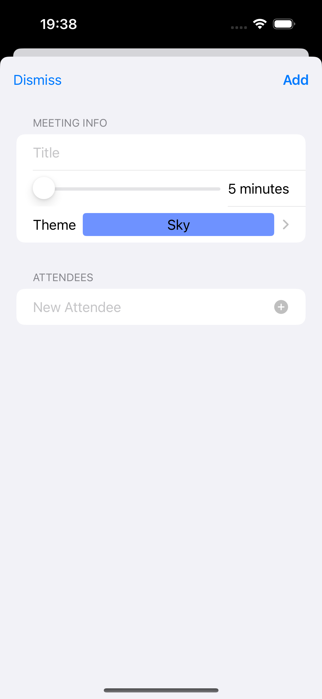
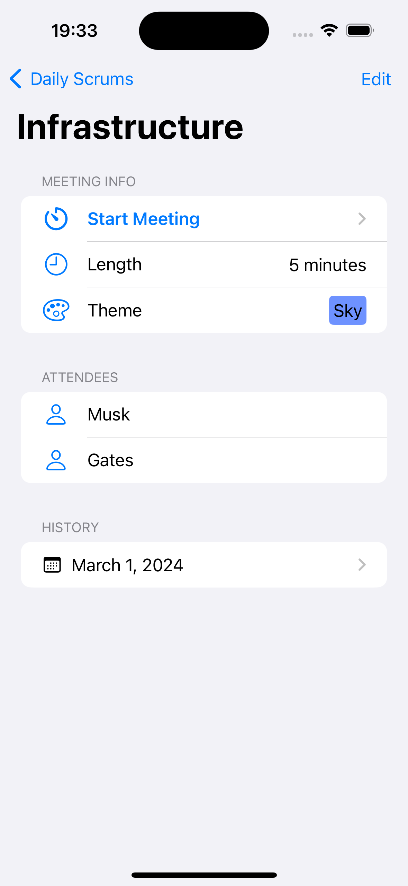
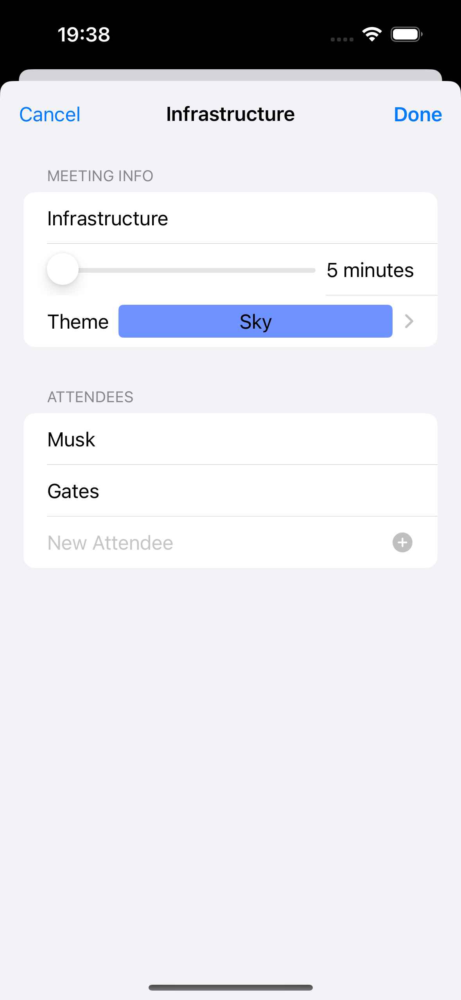
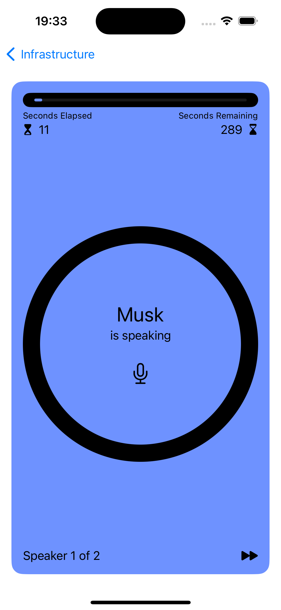
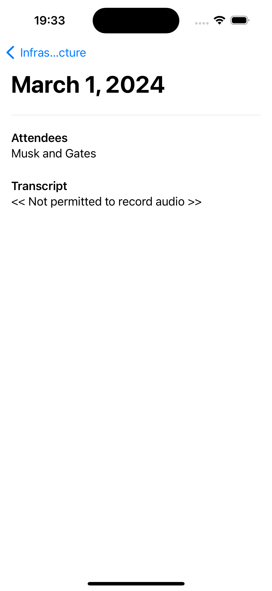

# [App Dev Tutorial SwiftUI](https://developer.apple.com/tutorials/app-dev-training/getting-started-with-scrumdinger)

Learn the essentials of iOS app development by building a fully functional app using SwiftUI.

## Screenshot

| Scrums                             | Add                          | Details                              |
|------------------------------------|------------------------------|--------------------------------------|
|  |  |  |

| Edit                           | Meeting                              | History                              |
|--------------------------------|--------------------------------------|--------------------------------------|
|  |  |  |

## Tech Stack

- App
- Scene
- WindowGroup
- VStack
- HStack
- ZStack
- ScrollView
- List
- Section
- Form
- Picker
- TextField
- Text
- Label
- Button
- Image
- Shape
- Circle
- RoundedRectangle
- Spacer
- Divider
- ProgressView
- ProgressViewStyle
- LabelStyle
- NavigationStack
- NavigationLink
- ToolbarItem
- @State
- @Binding
- @Published
- @StateObject
- @Environment
- ObservableObject
- CaseIterable
- Identifiable
- Codable
- async
- await
- throws
- Task
- Error
- FileManager
- JSONDecoder
- ListFormatter
- AVPlayer
- SFSpeechRecognizer
- AVAudioEngine
- AVAudioSession
