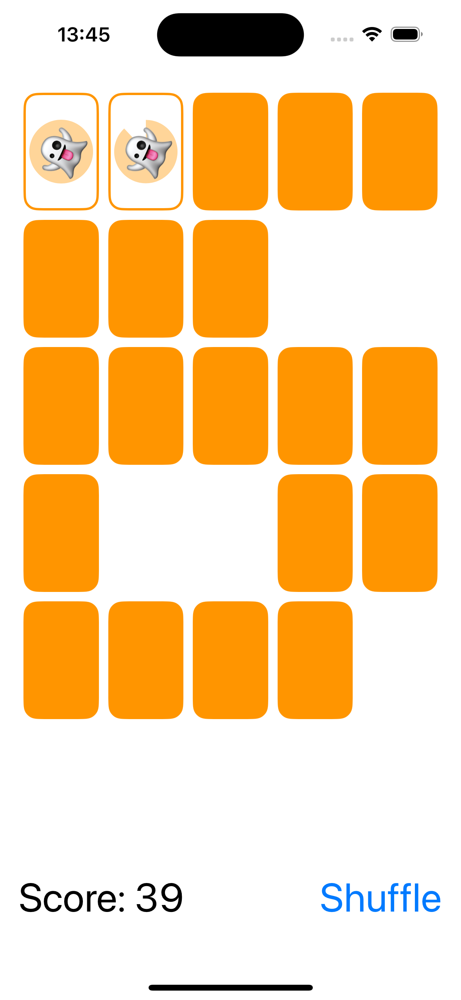
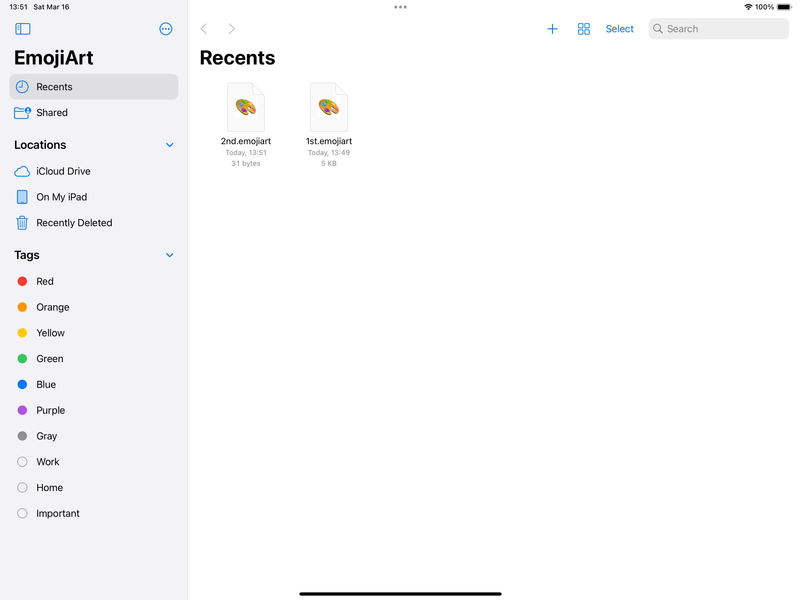
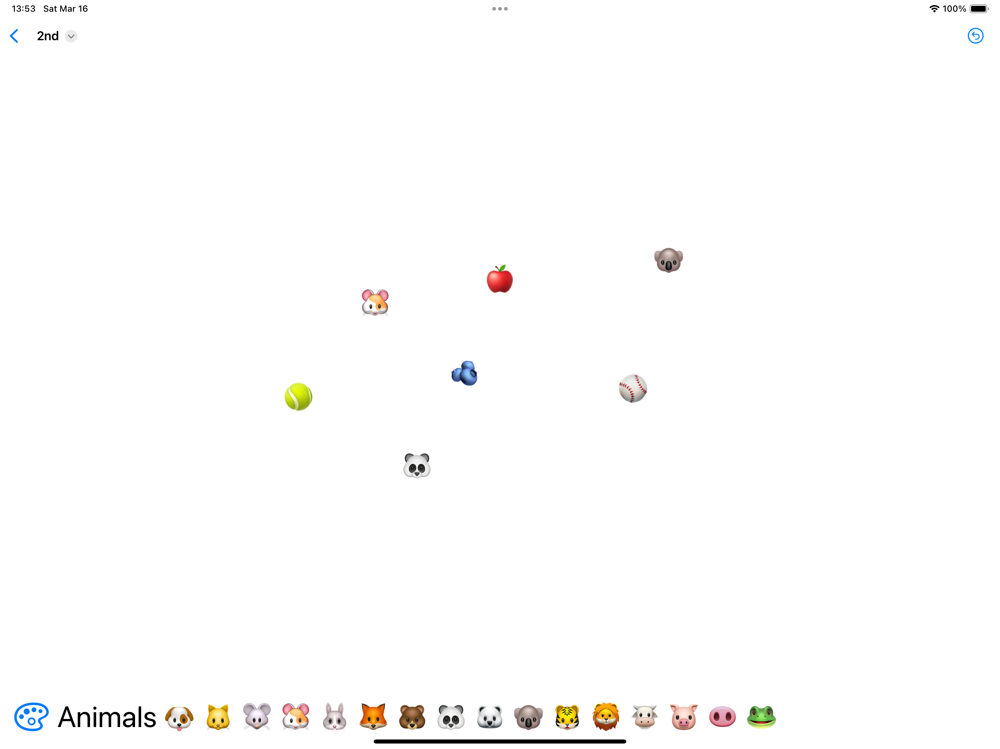

# [CS193p - Developing Apps for iOS 2023](https://cs193p.sites.stanford.edu/2023)

The lectures for the Spring 2023 version of Stanford University's course CS193p (Developing Applications for iOS using SwiftUI)

## Screenshot

| Memorize                               |
|----------------------------------------|
|  |

| EmojiArt-Document                                   | EmojiArt-Palette                                       |
|-----------------------------------------------------|--------------------------------------------------------|
|  |  |

## Tech Stack

- App
- Scene
- WindowGroup
- DocumentGroup
- VStack
- HStack
- ZStack
- ScrollView
- TimelineView
- LazyVGrid
- List
- Section
- Form
- TextField
- Text
- Label
- Button
- ButtonRole
- Image
- UIImage
- Shape
- RoundedRectangle
- Spacer
- Divider
- ProgressView
- Menu
- NavigationStack
- NavigationSplitView
- NavigationLink
- ToolbarItem
- GeometryReader
- GeometryProxy
- @ScaledMetric
- @ViewBuilder
- @FocusState
- @State
- @Binding
- @Published
- @StateObject
- @Environment
- @EnvironmentObject
- @escaping
- ObservableObject
- Identifiable
- Equatable
- Codable
- Hashable
- Transferable
- Animatable
- ViewModifier
- async
- await
- throws
- Task
- Error
- URL
- UserDefaults
- UTType
- ReferenceFileDocument
- FileWrapper
- UndoManager
- Document Types
- Exported Type Identifiers
- JSONDecoder
- JSONEncoder
- NotificationCenter
- NSObjectProtocol
- TransferRepresentation
- AnyTransition
