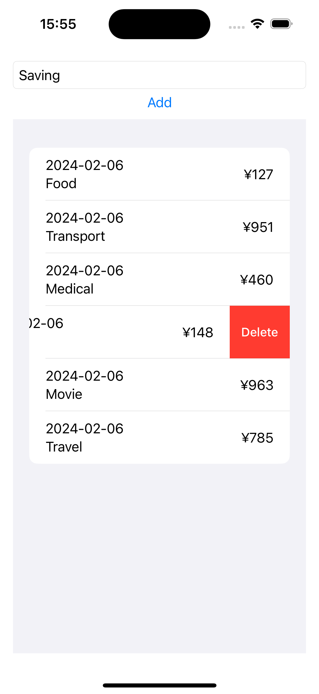

# [SwiftData](https://developer.apple.com/xcode/swiftdata/)

SwiftData makes it easy to persist data using declarative code. You can query and filter data using regular Swift code. And it’s designed to integrate seamlessly with SwiftUI.

## Screenshot

## Tech Stack

- @Model
- @Attribute
- @Query
- @Environment
- modelContainer
- VStack
- HStack
- List
- Text
- TextField
- Button
- Spacer
